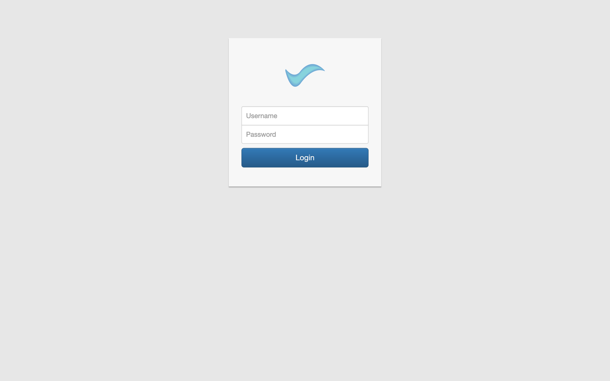
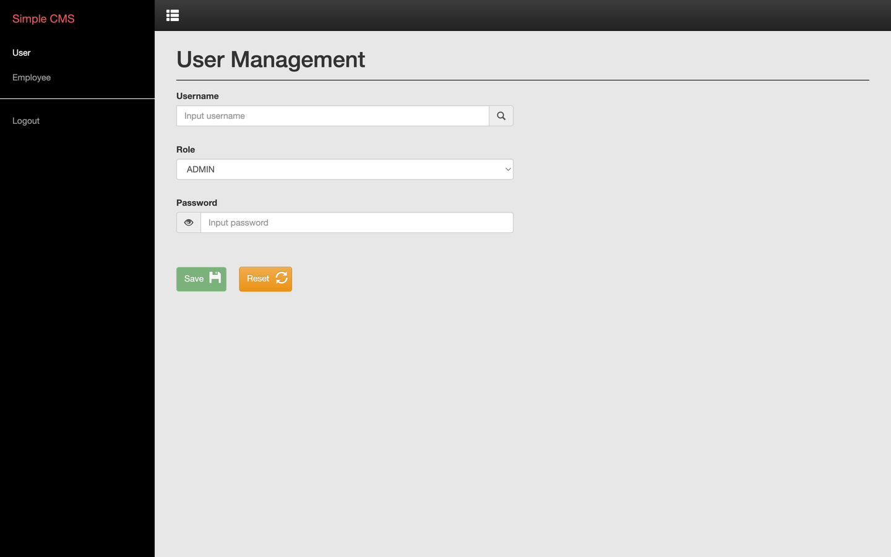
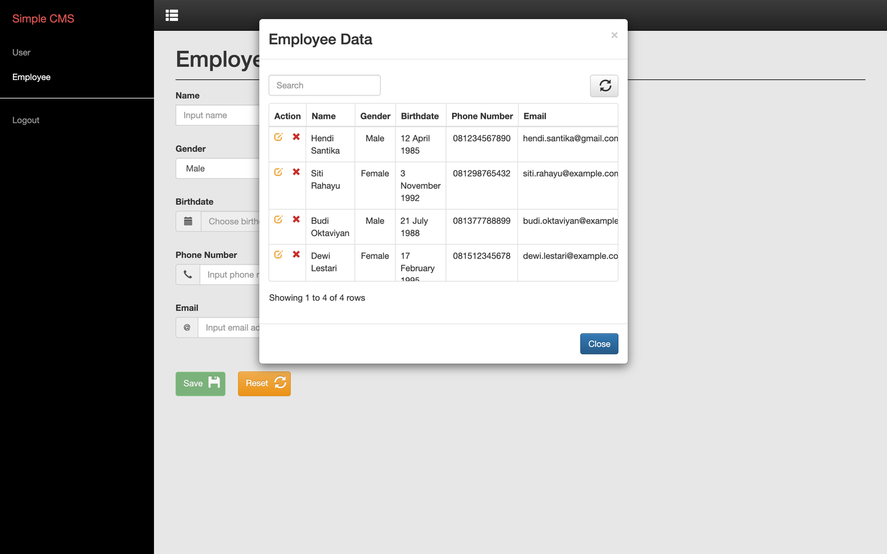
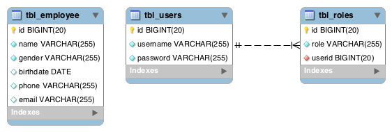

# CMS-Hendi

[](https://github.com/hendisantika/CMS-Hendi/actions/workflows/maven.yml)

A small Java CMS template: a Spring MVC + Hibernate web application, packaged as a WAR, with user and
employee master data behind form login.

## Screenshots



| User management | Employee data |
|---|---|
|  |  |

## Tech stack

| Component | Version |
|---|---|
| Java | 25 |
| Spring Framework | 7.0.9 |
| Spring Security | 7.1.1 |
| Hibernate ORM | 7.4.8.Final |
| Jakarta Servlet | 6.1 (Jakarta EE 11) |
| SiteMesh | 3.2.3 |
| MySQL Connector/J | 26.7.0 |
| Logging | SLF4J + Logback |
| Build | Maven, Jetty 12 (`ee11`) for local runs |

## Requirements

- JDK 25
- Maven 3.9+
- MySQL with a `db_testing` schema

## Database setup

Create the schema and load the tables and seed rows:

```bash
mysql -u root -p -e 'CREATE DATABASE IF NOT EXISTS db_testing;'
mysql -u root -p db_testing < src/main/resources/application.sql
```

Connection settings live in `src/main/webapp/WEB-INF/hibernate.cfg.xml` and default to
`jdbc:mysql://localhost:3306/db_testing` with `root`/`root`.



## Build

```bash
mvn clean package
```

This produces `target/CMS-Hendi-1.0.war`.

## Run

```bash
mvn jetty:run
```

| | |
|---|---|
| Context path | <http://localhost:8282/CMS-Hendi> |
| Login | `admin` |
| Password | `admin` |

To deploy elsewhere, drop `target/CMS-Hendi-1.0.war` into any Jakarta EE 11 servlet container
(Tomcat 11, Jetty 12 `ee11`, …).

## Project layout

```
src/main/java/com/hendi
├── controller   Spring MVC controllers (login, users, employee)
├── domain       JPA entities: Users, Roles, Employee
├── service      UserDetailsService and the Hibernate data access layer
└── utils        Account-status constants
src/main/webapp
├── WEB-INF      web.xml, Spring contexts, Hibernate and SiteMesh config
├── pages        JSP views and SiteMesh decorators
└── res          Static CSS, JS and assets
```

## Notes

- Passwords are hashed with BCrypt (`BCryptPasswordEncoder`). The seed row in `application.sql`
  contains a BCrypt hash of `admin`; older SHA-hashed rows will no longer authenticate.
- Authorities are stored without a `ROLE_` prefix, so the security rules use `hasAuthority` /
  `hasAnyAuthority` rather than `hasRole`.
